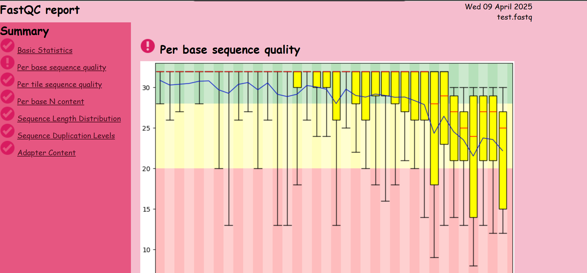

# p3-fastqc
*version 2.0 7-4-2025*
 
Practicum 3 &amp; BIN toolbox opdracht met FastQC als tool.

**System requirements**

This project is a python project, so having python installed is necessary. For the necessary 
packages please reference the requirements.txt file.

FastQC is a java application. In order to run it needs your system to have a suitable
Java Runtime Environment (JRE) installed.

Actually installing FastQC is not necessary as it comes included in the project. 

**Installatie**

fork, clone? project. to run the project, run the app.py script found in the website directory. 

**Commandline**

**author, contact & support**

Maartje van der Hulst contact?!

**references**

https://www.bioinformatics.babraham.ac.uk/projects/fastqc/

**licences**

hoe haal je het van github
verander niks aan de mappenstructuur
hoe voer je de website uit zodat die draait
upload bestand in website, kun je het downloaden?

wat heb je nodig? Java op je systeem, maar ook python ed?

- titel (tool/website)
# p3-fastqc
### Practicum 3 &amp; BIN toolbox opdracht met FastQC als tool.

- versie (evt changelog, kan ook als los bestand)
*version 2.0 7-4-2025*
- datum
- Omschrijving (plaatje output, welke onderzoeksvraag beantwoord het, wat zou het moeten doen als alles het goed doet)
This is web app created using the Flask web framework in python for the backend and HTML/CSS & 
  Javaschript for the frontend. The website contain further info about the project and the 
  FastQC tool. You can also use the tool via the app, just upload a fastq file and select your 
  preferred settings. The size of the file determines the speed of the tool, but as soon as the 
  file is uploaded and processed the app will take you to the results page with your report. The 
  FastQC tool is mostly used to check the quality of unprocessed genetic data. If there are 
  problems which are helped with trimming the data for example, then the test is usually run 
  again to check if the desired outcome is achieved. The tool gives per test it has run either a 
  pass (tick), warning (exclamation mark) or fail (cross/x) determined by the standard limits or 
  custom limits given by the user. While entering the setting for the tool, the help-pages for 
  each selected test is show for a description, example and common errors. The picture below 
  shows an example of a finished report. 

- systeemrequirements
This project is a python project, so having python installed is necessary. For the necessary 
packages please reference the requirements.txt file.

FastQC is a java application. In order to run it needs your system to have a suitable
Java Runtime Environment (JRE) installed.

Actually installing FastQC is not necessary as it comes included in the project. 
- Installatie (files/folders) config
fork, clone? project. to run the project, run the app.py script found in the website directory
- commandline voorbeeld
python PathToProject/website/app.py
> * Serving Flask app 'app' (lazy loading)
> * Environment: production
   WARNING: This is a development server. Do not use it in a production deployment.
   Use a production WSGI server instead.
> * Debug mode: on
> * Restarting with stat
> * Debugger is active!
> * Debugger PIN: 122-348-451
> * Running on http://127.0.0.1:5000/ (Press CTRL+C to quit)

click on the link, which should open a browser hosting the web app.

- support & contactgegevens (pas op met wat je publiek deelt)
mij nie bellen
- author
Maartje van der Hulst
- referenties (autheurcredits uit licenties tools en talen ed zoeken)
https://www.bioinformatics.babraham.ac.uk/projects/fastqc/
- licenties (gaat Peter miss wel les over geven) (wat voor licentie heeft je tool of libraries)

